## Sourcetree를 이용해 개발하기

### upstream 생성 하기
##### remote 확인
    $ git remote -v
>
    origin  https://github.com/sejong-interface/github-test (fetch)
    origin  https://github.com/sejong-interface/github-test (push)
>
##### upstream 리모트 추가
    $ git remote add  upstream https://github.com/sejong-interface/github-test.git
    $ git remote -v
>
    origin  https://github.com/sejong-interface/github-test (fetch)
    origin  https://github.com/sejong-interface/github-test (push)
    upstream  https://github.com/sejong-interface/github-test.git (fetch)
    upstream  https://github.com/sejong-interface/github-test.git (push)

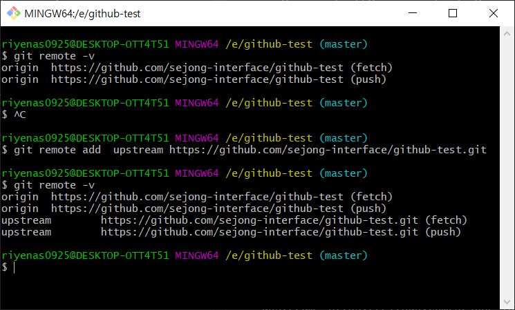

### develop branch 생성
#### 방법 1 sourcetree 사용
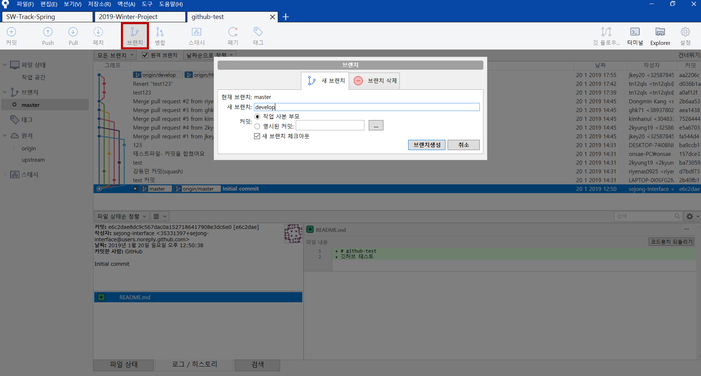
> sourcetree 같은 경우는 왼쪽 브랜치를 두번 클릭하는 것으로 체크아웃 할수 있다.

#### 방법 2 git bash 사용

    $git branch develop
    $git checkout develop
>
    결과>
    switched to branch 'develop'

![pic]images/git4.PNG)

### feature branch 생성
#### 방법 1 sourcetree 사용
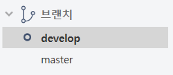
develop 브랜치를 두번클릭하여 master브랜치에서 develop브랜치로 체크아웃 한다.

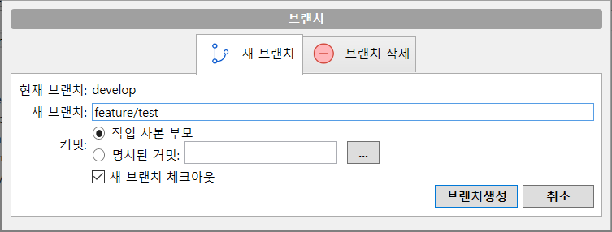
feature/기능 으로 이름을 정하고 생성한다.

#### 방법 2 git bash 사용
feature 브랜치는 develop 브랜치로 체크아웃되있는 상태에서 생성해야한다.

    $git checkout develop
    $git branch feature/test
    $git checkout feature/test
>
    결과>
    switched to branch 'feature/test'

### 파일 생성 및 작성
feature/test 브랜치를 체크아웃한다음  작업을 진행한다.

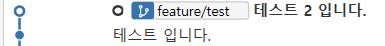

현재 두개의 커밋을 올리고 작업을 완료했다고 가정하면
PR을 올리기 전에 위의 두 커밋을 합치기 위해 rebase를 해준다.

    $git rebase -i HEAD~2

> rebase할 커밋이 두개이기 때문에 ~뒤에 숫자 2를 붙인다.

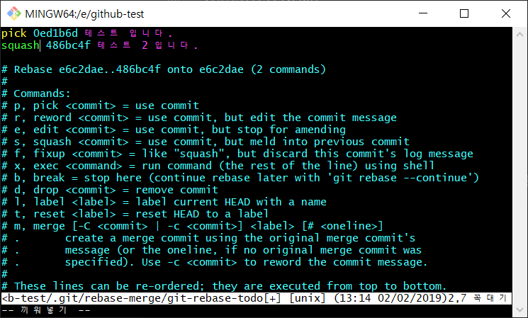
제일 마지막에 올렸던 커밋을 pick이 아닌 squash로 변경한다.

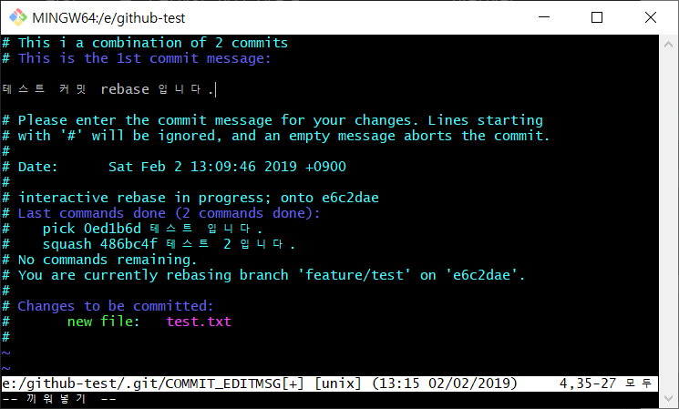
커밋 메시지를 제일위에 있는 메시지만 남기고 삭제한다.

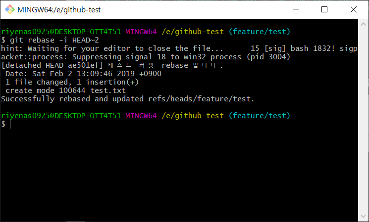

그러면 다음과 같이 커밋이 rebase 된걸 확인할수 있다.

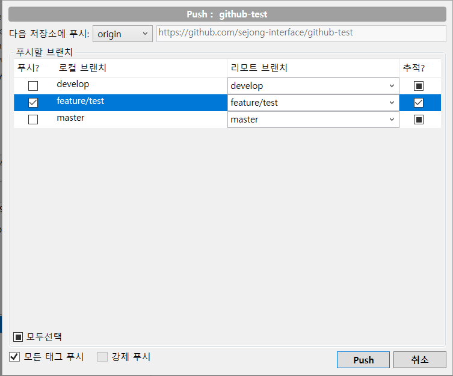
그다음 feature/test로 강제 푸시 한다.

    $git push -f origin feature/test

### PR 보내기
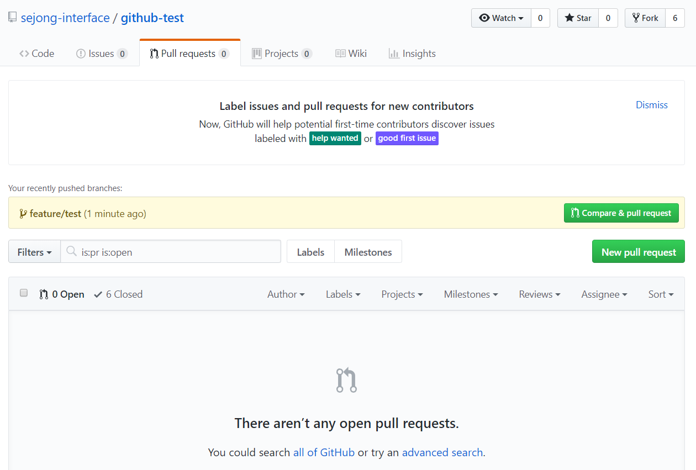
Compare & pull request를 눌러 PR을 생성한다.

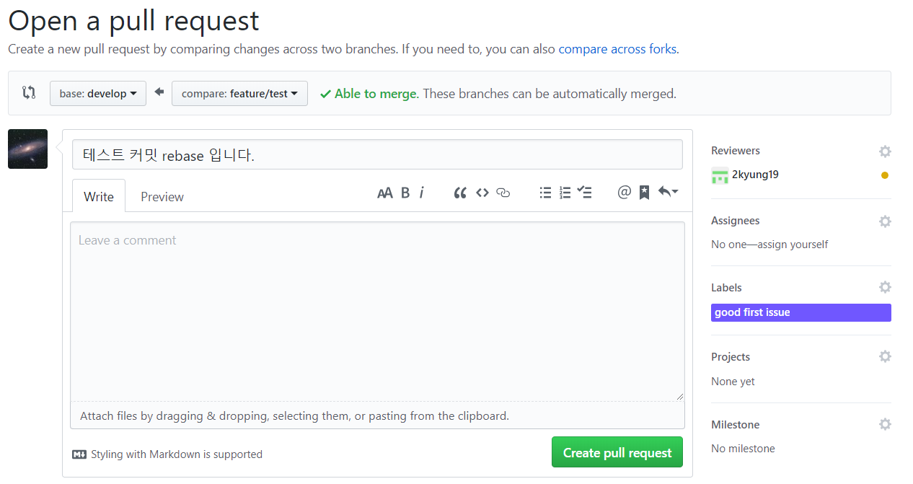
compare across forks를 눌러

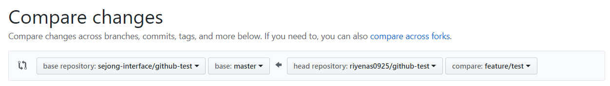
다음과 같이 자신의 포크한 저장소의 feature브랜치를 원본 저장소의 develop를 가르키게 변경한다.

Reviewer와, Labels를 정하고 create pull request를 눌러 PR를 만든다.