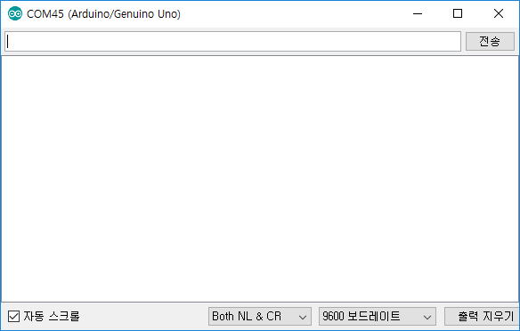
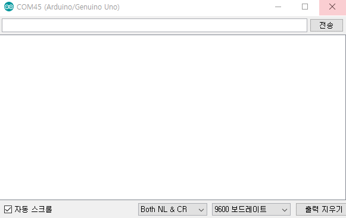

### AT 커맨드로 HTTP 전송

    테스트 보드 : Arduino UNO
    WIFI 모듈 : ESP8266
    baud rate : 9600

##### 목표 : ESP8266 WIFI 모듈을 이용하여 GET 방식으로 HTTP 통신 하기


우선 AT 커맨드를 이용하여 테스트 하기 위해 다음과 같이 소스코드를 작성함

```c++
#include<SoftwareSerial.h>

SoftwareSerial ESP8266(2,3);

void setup() {
  Serial.begin(9600);
  ESP8266.begin(9600);
}

void loop() {
  if(Serial.available()){
    ESP8266.write(Serial.read());
  }

  if(ESP8266.available()){
    Serial.write(ESP8266.read());
  }
}
```

#### 아두이노 시리얼 모니터 설정



    baud rate : 9600
    Both NL & CR
>

다음 순서를 따라 AT 커맨드를 입력한다.



>
    AT
    AT+GMR
    AT+CWMODE=3
    AT+CWLAP
    AT+CWJAP="와이파이 이름","비밀번호"

    //예시 : riyenas0925.dothome.co.kr/tree.php?time=9999 이렇게 전송하고 싶다면 아래 처럼 하면 된다.
    AT+CIPSTART="TCP","riyenas0925.dothome.co.kr",80
    AT+CIPSEND=87

    GET /tree.php?time=999 HTTP/1.1
    Host: riyenas0925.dothome.co.kr
    Connection: close

>

#### 입력 결과


#### AT 커맨드 입력,응답 예시
```sql
AT


OK
AT+GMR

AT version:1.3.0.0(Jul 14 2016 18:54:01)
SDK version:2.0.0(5a875ba)
Farylink Technology Co., Ltd. v1.0.0.2
May 11 2017 22:23:58
OK
AT+CWMODE=3


OK
AT+CWLAP

+CWLAP:(4,"olleh_WiFi_E912",-95,"08:5d:dd:b1:e9:16",1,-12,0)
+CWLAP:(5,"U+zone",-88,"00:08:52:34:03:1c",1,-2,0)
+CWLAP:(4,"KT_WLAN_D632",-86,"00:27:1c:d6:f3:25",2,-12,0)
+CWLAP:(4,"iptime",-65,"88:36:6c:8d:a6:cc",3,8,0)
+CWLAP:(3,"U+Net38CB",-91,"00:08:5b:92:38:c9",3,15,0)
+CWLAP:(4,"Happy",-59,"88:36:6c:24:bf:e6",8,21,0)
+CWLAP:(3,"livecast-58fc82",-87,"e2:b2:f1:8d:ce:90",9,-32,0)
+CWLAP:(4,"olleh_WiFi_1285",-90,"00:07:89:18:12:88",3,-32,0)

OK
AT+CWJAP="iptime","비밀번호"

WIFI DISCONNECT
WIFI CONNECTED
WIFI GOT IP

OK
AT+CIPSTART="TCP","riyenas0925.dothome.co.kr",80

CONNECT

OK


AT+CIPSEND=87


OK
> 
Recv 87 bytes

SEND OK

+IPD,190:HTTP/1.1 200 OK
Date: Sat, 12 Jan 2019 10:33:58 GMT
Server: Apache/2.2.15 (CentOS)
Content-Length: 38
Connection: close
Content-Type: text/html

INSERT INTO time (time) VALUES ('999')CLOSED
```